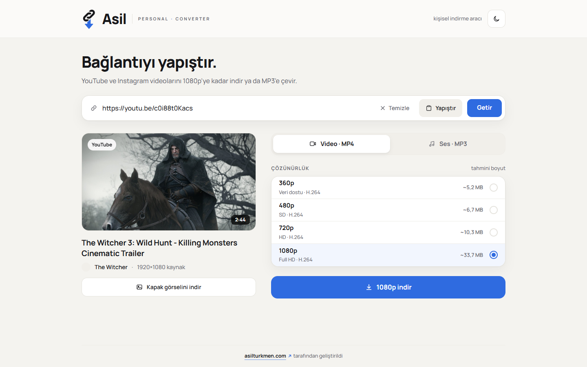
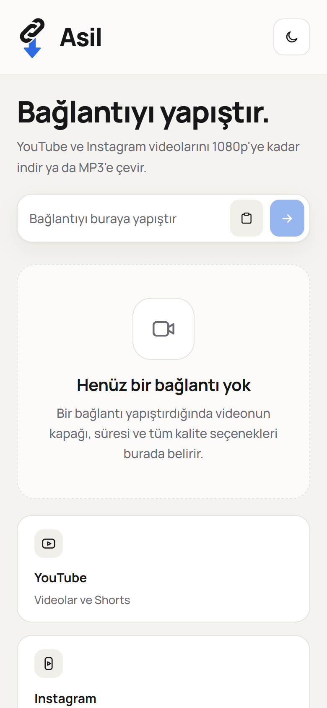
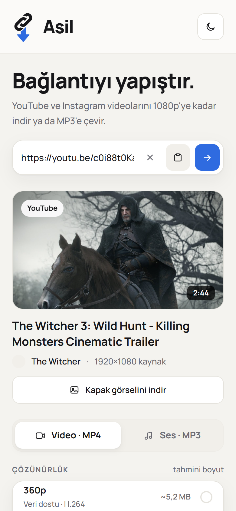
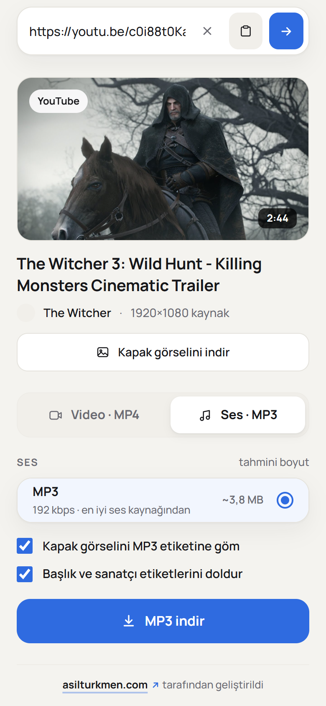
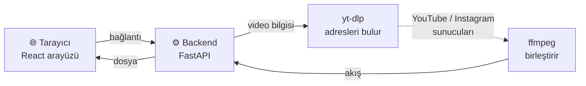
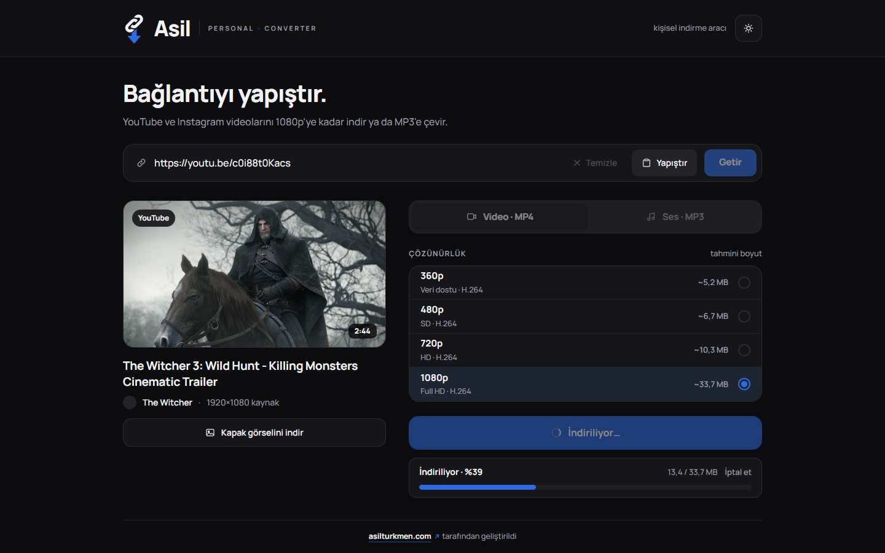

<div align="center">


# Asil Personal-Converter

**Bağlantıyı yapıştır, MP4 ya da MP3 olarak indir.**

YouTube ve Instagram videoları için sade, hızlı, kendi bilgisayarında çalışan bir indirme aracı.


</div>

<br />

<picture>
  <source media="(prefers-color-scheme: dark)" srcset="docs/images/desktop-dark.png" />
  
</picture>

## Neler yapabilir?

- 🎬 **YouTube** videoları ve Shorts, **Instagram** reels, gönderi videoları ve hikâyeler
- 📐 **1080p'ye kadar** her çözünürlük; dikey videolarda da doğru etiket (Shorts'ta 1080p = 1080×1920)
- 🎵 **MP3'e çevirme**: 192 kbps, kapak görseli ve başlık/sanatçı etiketleriyle
- ⚡ **Yeniden kodlama yok**: video olduğu gibi kopyalanır, kalite kaybı olmaz, işlemci yorulmaz
- 📊 **Gerçek ilerleme**: yüzde, çubuk ve "45 / 118 MB"; yarıda kesilen dosya asla "indirildi" görünmez
- 🌗 **Açık / koyu tema**, telefonda da rahat kullanım
- 🔒 **Diske hiçbir şey yazılmaz**: video sunucudan yalnızca akarak geçer, geçici dosya yok

<table>
  <tr>
    <td align="center" width="33%">
      <picture>
        <source media="(prefers-color-scheme: dark)" srcset="docs/images/mobile-empty-dark.png" />
        
      </picture>
      <br /><sub>Bağlantıyı yapıştır</sub>
    </td>
    <td align="center" width="33%">
      <picture>
        <source media="(prefers-color-scheme: dark)" srcset="docs/images/mobile-video-dark.png" />
        
      </picture>
      <br /><sub>Kaliteyi seç</sub>
    </td>
    <td align="center" width="33%">
      <picture>
        <source media="(prefers-color-scheme: dark)" srcset="docs/images/mobile-mp3-dark.png" />
        
      </picture>
      <br /><sub>ya da MP3'e çevir</sub>
    </td>
  </tr>
</table>

## Nasıl çalışır?



1. Bağlantıyı yapıştırırsın; **yt-dlp** videonun başlığını, kapağını ve kalite seçeneklerini bulur (hiçbir şey indirmeden).
2. Bir kalite seçip indire basarsın; **ffmpeg** görüntü ve sesi doğrudan YouTube/Instagram'dan okuyup tek bir MP4'te birleştirir.
3. Dosya oluştukça tarayıcına akar. Ne bilgisayarında ne sunucuda ara dosya oluşur.

<br />

<picture>
  <source media="(prefers-color-scheme: dark)" srcset="docs/images/desktop-downloading-dark.png" />
  
</picture>

## Kendi bilgisayarına kur

Yaklaşık 5 dakika sürer. Windows, macOS ve Linux'ta çalışır.

### 1. Gerekenler

| | Neden | Sürüm |
|---|---|---|
| **Python** | backend | 3.12 veya üstü |
| **Node.js** | arayüz | 20 veya üstü |
| **ffmpeg** | video birleştirme ve MP3 | 7.1 veya üstü |
| **Deno** | yt-dlp'nin YouTube'u çözebilmesi için | 2.3 veya üstü |

<details>
<summary><b>Windows</b></summary>

PowerShell'de:

```powershell
winget install -e --id Python.Python.3.12
winget install -e --id OpenJS.NodeJS.LTS
winget install -e --id Gyan.FFmpeg
winget install -e --id DenoLand.Deno
```

Kurulum bitince **PowerShell'i kapatıp yeniden aç** (yeni programlar ancak o zaman görünür).

</details>

<details>
<summary><b>macOS</b></summary>

[Homebrew](https://brew.sh) ile:

```bash
brew install python node ffmpeg deno
```

</details>

<details>
<summary><b>Linux (Ubuntu / Debian)</b></summary>

```bash
sudo apt install python3 python3-venv ffmpeg nodejs npm
curl -fsSL https://deno.land/install.sh | sh
```

Dağıtımının paketleri eskiyse (örneğin Ubuntu 24.04'te Node.js 18 ve ffmpeg 6.1 geliyor)
Node.js'i [nodejs.org](https://nodejs.org)'dan, ffmpeg'i [ffmpeg.org](https://ffmpeg.org/download.html#build-linux)'daki
Linux derlemelerinden kur.

</details>

Hepsinin kurulduğunu kontrol et; dördü de bir sürüm numarası yazmalı:

```bash
python --version    # macOS/Linux'ta: python3 --version
node --version
ffmpeg -version
deno --version
```

### 2. Projeyi indir

```bash
git clone https://github.com/Asilturkmen/Personal-converter.git
cd Personal-converter
```

### 3. Backend'i başlat

<table>
<tr><th>Windows (PowerShell)</th><th>macOS / Linux</th></tr>
<tr>
<td>

```powershell
cd backend
python -m venv .venv
.venv\Scripts\Activate.ps1
pip install -r requirements.txt
python serve.py
```

</td>
<td>

```bash
cd backend
python3 -m venv .venv
source .venv/bin/activate
pip install -r requirements.txt
python serve.py
```

</td>
</tr>
</table>

`Uvicorn running on http://127.0.0.1:8000` yazısını görünce hazır. Bu pencereyi açık bırak.

### 4. Arayüzü başlat

**Yeni bir terminal** aç, proje klasöründe:

```bash
npm install
npm run dev
```

Tarayıcıda **http://localhost:5173** adresini aç. Bu kadar! 🎉

> Sonraki seferlerde yalnızca iki komut yeter: `backend` klasöründe ortamı etkinleştirip
> `python serve.py`, proje klasöründe `npm run dev`.

## Kullanım

1. Bir YouTube ya da Instagram bağlantısı kopyala.
2. Kutuya yapıştır (ya da **Yapıştır**'a bas); video kendiliğinden gelir.
3. **Video · MP4** sekmesinden kaliteyi seç ya da **Ses · MP3**'e geç.
4. **İndir**'e bas. Bitince **Temizle** ile baştan başlayabilirsin.

**Telefondan kullanmak** için bilgisayar ve telefon aynı Wi-Fi'da olsun: `npm run dev` yerine
`npm run dev:lan` çalıştır, terminalde yazan `http://192.168.x.x:5173` adresini telefonda aç.

## Instagram hikâyeleri

Reels ve gönderi videoları giriş yapmadan çalışır; **hikâyeler için Instagram oturumu gerekir**:

1. Tarayıcına **Get cookies.txt LOCALLY** eklentisini kur.
2. Instagram'a **ikincil bir hesapla** giriş yap (ana hesabını kullanma).
3. instagram.com açıkken eklentiyle `cookies.txt` dosyasını indir ve `backend/` klasörüne koy.

Oturum zamanla düşer; backend konsolunda "Instagram oturum istedi" uyarısını görürsen dosyayı
yeniden indir.

## Ayarlar

Varsayılanlar çoğu kişi için yeterli. Değiştirmek istersen `backend/.env.example`
dosyasını `backend/.env` olarak kopyala ve istediğin satırı aç, örneğin:

```ini
MAX_HEIGHT=1080            # en yüksek çözünürlük
MAX_DURATION_MINUTES=90    # en uzun video
MP3_BITRATE_KBPS=192       # MP3 kalitesi
PORT=8000                  # backend portu
```

Tüm ayarların listesi: [docs/TEKNIK.md](docs/TEKNIK.md#ayarlar-env).

## Sorun giderme

<details>
<summary><b>YouTube videoları gelmiyor ya da indirme bozuldu</b></summary>

YouTube ayda birkaç kez bir şeyi değiştiriyor. İlk yapılacak şey yt-dlp'yi güncellemek:

```bash
cd backend
# ortamı etkinleştir (Windows: .venv\Scripts\Activate.ps1 · macOS/Linux: source .venv/bin/activate)
pip install -U "yt-dlp[default]"
```

Sonra backend'i yeniden başlat.

</details>

<details>
<summary><b>Konsolda "JavaScript runtime bulunamadı" uyarısı</b></summary>

Deno kurulu değil, sürümü 2.3'ten eski ya da terminal onu henüz görmüyor. Deno'yu kur
(ya da `deno upgrade` ile güncelle), terminali kapatıp yeniden aç.
Doğru çalıştığını http://localhost:8000/api/health adresinden görebilirsin: `"jsRuntime": "deno"` yazmalı.

</details>

<details>
<summary><b>Windows: "running scripts is disabled on this system"</b></summary>

PowerShell'de bir kez şunu çalıştır, sonra tekrar dene:

```powershell
Set-ExecutionPolicy -Scope CurrentUser RemoteSigned
```

</details>

<details>
<summary><b>"Sunucuya ulaşılamadı" hatası</b></summary>

Backend çalışmıyor. `backend` klasöründe `python serve.py` komutunun açık bir terminalde
çalıştığından emin ol.

</details>

<details>
<summary><b>"Address already in use" / port kullanımda</b></summary>

8000 portunu başka bir program kullanıyor. `backend/.env` dosyasına `PORT=8010` yaz ve
`vite.config.ts` içindeki `http://127.0.0.1:8000` adresini de aynı porta çevir.

</details>

## Proje yapısı

```
Personal-converter/
├─ src/          React arayüzü
├─ public/       logo ve statik dosyalar
├─ backend/      FastAPI + yt-dlp + ffmpeg
└─ docs/         teknik belgeler ve görseller
```

Nasıl çalıştığının ayrıntıları, API ve tasarım kararları: **[docs/TEKNIK.md](docs/TEKNIK.md)**

## Sorumluluk

Bu araç kişisel kullanım içindir. İndirdiğin içeriklerin telif haklarına ve YouTube ile
Instagram'ın kullanım koşullarına uymak senin sorumluluğundadır.

## Lisans

[MIT](LICENSE). Kodu dilediğin gibi kullanabilir, değiştirebilir ve dağıtabilirsin;
telif satırını ve lisans metnini koruman yeterli.

<div align="center">
<br />
<sub><a href="https://asilturkmen.com">asilturkmen.com</a> tarafından geliştirildi</sub>
</div>
